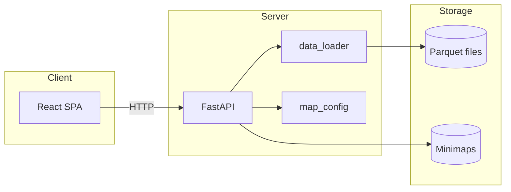

# LILA BLACK Telemetry Viewer — System Design & Tech Stack

## 1. High-level architecture

```
┌─────────────────────────────────────────────────────────────────────────────┐
│                              Browser (Level Designer)                        │
│  ┌──────────────────────────────────────────────────────────────────────┐   │
│  │  React SPA                                                            │   │
│  │  • Filters (map, date, match)  • Map canvas (paths + events + heatmap) │   │
│  │  • Timeline / playback         • Legend                                │   │
│  └──────────────────────────────────────────────────────────────────────┘   │
└─────────────────────────────────────┬───────────────────────────────────────┘
                                      │ HTTP (JSON, images)
                                      ▼
┌─────────────────────────────────────────────────────────────────────────────┐
│                              Backend (single process)                        │
│  ┌──────────────────────────────────────────────────────────────────────┐   │
│  │  FastAPI                                                              │   │
│  │  /api/maps  /api/days  /api/matches  /api/match/{id}  /api/heatmap/…   │   │
│  │  /api/minimaps/{map_id}  (static: frontend dist + minimap images)      │   │
│  └──────────────────────────────────────────────────────────────────────┘   │
│                                      │                                        │
│  ┌───────────────────────────────────▼───────────────────────────────────┐   │
│  │  Data layer (Python)                                                  │   │
│  │  • Parquet read (pyarrow/pandas)  • World→pixel conversion            │   │
│  │  • Match aggregation  • Heatmap grid computation                      │   │
│  └───────────────────────────────────┬───────────────────────────────────┘   │
└─────────────────────────────────────┼───────────────────────────────────────┘
                                      │ file I/O
                                      ▼
┌─────────────────────────────────────────────────────────────────────────────┐
│                              Data (filesystem)                               │
│  player_data/                                                                │
│  ├── February_10/ … February_14/   (Parquet files: one per player per match)│
│  └── minimaps/                      (PNG/JPG: one per map)                    │
└─────────────────────────────────────────────────────────────────────────────┘
```

---

## 2. Data flow

```
┌──────────────┐     list days/maps      ┌──────────────┐     scan dirs + read   ┌──────────────┐
│   Frontend   │ ──────────────────────► │   FastAPI    │ ────────────────────► │  Parquet     │
│   (filters)  │     list matches        │   (API)      │     first row per file │  (by day)    │
└──────────────┘ ◄───────────────────── └──────────────┘ ◄──────────────────── └──────────────┘
       │                        JSON              │
       │                                          │
       │  load match / heatmap                    │  read all files for
       │  (match_id + map_id)                     │  match_id → aggregate
       ▼                                          ▼
┌──────────────┐     match payload        ┌──────────────┐
│   MapView    │ ◄────────────────────── │  data_loader │
│   (canvas)   │     positions + events   │  + map_config│
│   Timeline   │     in pixel coords      │  (world→px)  │
└──────────────┘     bounds [ts_min, max] └──────────────┘
```

- **List phase:** Backend scans day folders, parses filenames to get `(user_id, match_id)`, optionally reads one row per file to filter by `map_id`. Returns lightweight JSON (match_id, day, map_id).
- **Load match:** Backend finds all files for that `match_id`, reads Parquet, decodes `event` bytes, converts (x, z) → (px, py) per map config, returns one payload per match (players, positions, events, bounds).
- **Heatmap:** Same match load, then aggregate positions or events into a 64×64 grid; return grid + max for frontend to render as overlay.

---

## 3. Component breakdown

| Component | Responsibility |
|-----------|----------------|
| **Frontend (React)** | UI state, filters, API client, canvas drawing (paths, event markers, heatmap overlay), timeline state and playback loop. |
| **Backend (FastAPI)** | Routing, CORS, serve static frontend + minimap images, delegate all data to data layer. |
| **Data loader** | List days; list matches (with optional day/map filter); load full match (all players, positions, events in pixel coords); build heatmap grid. |
| **Map config** | World-to-minimap conversion (scale, origin per map); 1024×1024 pixel space. |
| **Data (filesystem)** | Parquet files under day folders; minimap images. No database. |

---

## 4. Tech stack choices

### 4.1 Overview

| Layer | Choice | Rationale |
|-------|--------|-----------|
| **Backend runtime** | Python 3.11+ | Parquet tooling (pyarrow, pandas) is mature; FastAPI is simple and async-capable. |
| **Backend framework** | FastAPI | Lightweight, OpenAPI, easy to add routes and serve static files; good for a single-service API. |
| **Parquet / data** | PyArrow + Pandas | PyArrow reads Parquet natively (no extension needed); Pandas for row iteration and datetime handling. Decode `event` bytes in Python before sending JSON. |
| **Frontend runtime** | Node (Vite + React) | Standard SPA stack; Vite gives fast dev and a simple production build. |
| **Frontend framework** | React 18 + TypeScript | Component model fits filters + map + timeline; TypeScript for API types and fewer runtime errors. |
| **Rendering (map)** | HTML5 Canvas | Many points/lines and a heatmap grid; canvas is a good fit. Minimap is a background image; paths and markers drawn on top. |
| **Styling** | Plain CSS | No design system dependency; dark theme and layout in one place. |
| **Deployment** | Single process (backend serves frontend) or Docker | One URL, no CORS for production; optional Docker for portability and volume mount for data. |

### 4.2 Why not…

| Alternative | Reason not used (for this project) |
|-------------|-----------------------------------|
| **Parquet in the browser** | Would require WASM/JS parquet libs and still need to serve files; backend keeps data local and does world→pixel once. |
| **Database (Postgres/SQLite)** | Data is static and file-based; listing/loading by match_id is simple with a scan; avoids schema and ETL for an internal tool. |
| **Separate frontend host only** | Backend can serve the built SPA and minimaps so one deployment and one shareable link. |
| **WebGL for map** | Canvas is enough for paths + markers + heatmap; WebGL would add complexity without a clear need for this dataset size. |
| **Real-time / WebSockets** | Playback is over historical data; timeline is driven by a timer and slider, no server push. |

### 4.3 Key design decisions

1. **World→pixel on the backend**  
   Map config (scale, origin) lives in one place; frontend only receives pixel coordinates. Avoids duplicating conversion logic and keeps the API simple.

2. **Match-centric API**  
   All queries are “by match” (and map). No “all events in a bounding box” or time-range query; the tool is for reviewing one match at a time.

3. **Heatmap on demand**  
   Heatmaps are computed when the user selects a type (traffic/kills/deaths) for the current match. No precomputed tiles or stored heatmaps; acceptable for ~1.2k files and single-match scope.

4. **Single deployable**  
   Backend serves `frontend/dist` and minimaps so the app is one service and one shareable URL (e.g. for Level Design).

---

## 5. File layout (repo)

```
player_data/
├── backend/           # Python FastAPI app
│   ├── main.py         # Routes, static serving
│   ├── data_loader.py  # Parquet read, match aggregation, heatmap
│   ├── map_config.py   # World→pixel constants
│   └── requirements.txt
├── frontend/           # React + Vite SPA
│   ├── src/
│   │   ├── api.ts      # API client + types
│   │   ├── App.tsx     # State, filters, timeline, heatmap toggles
│   │   ├── MapView.tsx # Canvas: minimap + paths + events + heatmap
│   │   ├── Filters.tsx
│   │   ├── Timeline.tsx
│   │   ├── HeatmapControls.tsx
│   │   └── Legend.tsx
│   └── vite.config.ts  # Dev proxy to backend
├── February_10/ …      # Parquet data (not in repo if large)
├── minimaps/
├── Dockerfile          # Backend + frontend dist; data mounted at /data
├── DEPLOY.md
├── README.md
└── SYSTEM_DESIGN.md    # This document
```

---

## 6. Optional: Mermaid diagram

For docs that render Mermaid (e.g. GitHub, Notion), the same flow can be drawn as:



---

**Summary:** The system is a **single-service web app**: browser talks to one backend that reads Parquet and serves JSON + images. The tech stack (Python/FastAPI + React/Canvas) is chosen to keep parsing and coordinate logic on the server, keep the frontend focused on visualization and playback, and allow a single deployable with a shareable link.

---

## 7. Critical review: do the decisions hold up?

### What’s sensible

| Decision | Verdict | Why |
|----------|--------|-----|
| **Single backend (API + static frontend)** | Good | One URL, no CORS in production, simple deploy and shareable link for Level Design. |
| **Python + PyArrow/Pandas for Parquet** | Good | Parquet tooling is mature; decoding bytes and world→pixel in one place avoids duplicating logic in the browser. |
| **World→pixel on backend only** | Good | Map config lives in one place; frontend only renders pixel coords. No risk of client/server formula drift. |
| **Match-centric API** | Good | Fits the use case (“review one match at a time”); no need for bbox or time-range queries. |
| **No database** | Reasonable | Data is static and file-based; a DB would add schema and ETL. For ~1.2k files and internal use, filesystem is acceptable. |
| **React + Canvas** | Good | Fits path + markers + heatmap at this data size; WebGL would add complexity without a clear win. |
| **Heatmap on demand** | Reasonable | Simple: recompute when the user picks a type. No tile storage or pre-aggregation. |

### Data pipeline: where it makes sense and where it hurts

**Flow:** List (scan dirs + read one row per file for map_id) → Load match (find all files for `match_id`, read full Parquet, convert coords, sort, return JSON) → Heatmap (same as load match, then aggregate into 64×64 grid).

- **Listing matches** — We scan day folders and open **every** `.nakama-0` file to get `map_id` for filtering. That’s O(files) disk reads (~1.2k). Acceptable for an internal tool but slow on cold start. A small **index file** (match_id → day, map_id) would make listing O(1) and avoid opening Parquet for list.

- **Loading a match** — Match data is one file per player per match; we have to find and read all files for that match_id. That shape is inherent to the data. Doing it on demand (no pre-aggregation) is consistent with “no DB” and keeps the pipeline simple.

- **Heatmap** — Each heatmap request calls `load_match` again, so we re-read and re-process the same match. No shared cache. For a single user and typical match size this is fine; an **in-memory LRU cache** keyed by (match_id, map_id) would make the second request and heatmap toggles cheap.

- **Payload size** — We send the full match (all positions, all events) in one JSON. For 50 players × thousands of position samples the payload can be large. For current match sizes it’s workable; if matches or concurrency grew, we’d consider downsampling positions or streaming.

### When to revisit

- **Many concurrent users or slow list:** Add a match index (or DB) for listing and consider caching load_match (e.g. LRU or Redis).
- **Very large matches or slow frontend:** Downsample positions or send only a time window; optionally stream.
- **Data grows beyond static snapshot:** Introduce a proper store and possibly pre-aggregation for heatmaps.

**Bottom line:** The architecture and tech stack are **sensible for a single-user, internal Level Design tool** with static Parquet files. The data pipeline is **coherent** (list → load by match → derive heatmap from same load); the main tradeoffs are **no index for listing** and **no caching**, which are acceptable at current scale and easy to add later if needed.
